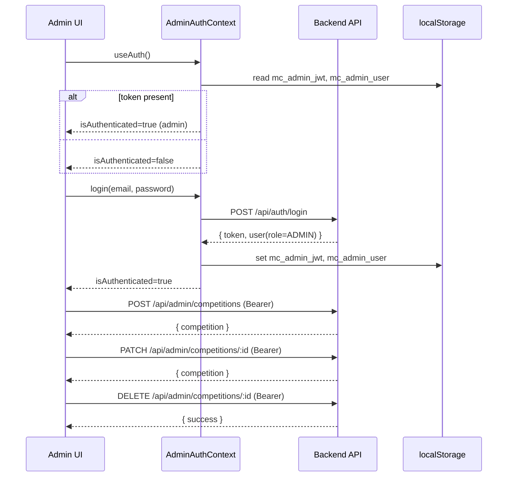

# Admin Frontend (Mini Competition Dashboard)

## Tech Stack

- React + TypeScript
- Vite (dev/build)
- Tailwind CSS
- Axios

## Prerequisites

- Node.js 18+
- npm 9+

## Environment Variables

Create `.env` in `admin-frontend/` (or `.env.local`):

```env
VITE_API_URL=http://localhost:4000/api
```

If not set, the app defaults to `http://localhost:4000/api`.

## Install & Run

```bash
cd admin-frontend
npm install
npm run dev         # starts Vite dev server
# Open the URL printed by Vite (usually http://localhost:5174)
```

## Build & Preview

```bash
npm run build       # outputs to dist/
npm run preview     # serves the production build locally
```

## Auth & Storage

- JWT token key: `mc_admin_jwt`
- Admin user snapshot key: `mc_admin_user`

Only users with `role=ADMIN` can log in to this app. The admin auth context validates the role after login and stores the token and user in localStorage.

## Project Structure (key files)

- `src/contexts/AuthContext.tsx`: admin auth state, role check
- `src/api/api.ts`: Axios instance + interceptors
- `src/api/auth.ts`: admin login API
- `src/pages/*`: admin views (Dashboard, Login, Users, Transactions, ManageCompetitions)
- `src/components/AdminProtectedRoute.tsx`: guard for admin-only routes
- `src/constants/storage.ts`: `USER_STORAGE_KEY`, `TOKEN_STORAGE_KEY` for admin

## Routing (Admin)

- `/admin/login` → admin login
- `/admin` → dashboard
- `/admin/competitions` → create/update competitions
- `/admin/users` → users list/details
- `/admin/transactions` → transactions overview

Protected by `AdminProtectedRoute` and `useAuth()` (admin variant).

## Swagger (Admin Endpoints)

The backend Swagger groups admin endpoints under the `Admin` tag. Open it at:

- UI: `http://localhost:4000/api/docs`
- JSON: `http://localhost:4000/api/docs/json`

Key admin endpoints:

- POST `/api/admin/competitions`
- PATCH `/api/admin/competitions/:id`
- DELETE `/api/admin/competitions/:id`

All require Bearer JWT with an admin user.

## Troubleshooting

- Login blocked: Ensure your user has `role=ADMIN`.
- Redirects to `/admin/login` frequently: Verify token stored in `mc_admin_jwt` and backend URL in `VITE_API_URL`.

## Mermaid Diagrams

### Admin Frontend Architecture

```mermaid
flowchart LR
  subgraph UI[React Admin UI]
    H[AdminNavbar] --> R[Routes]
    R --> AD[AdminDashboard]
    R --> MC[ManageCompetitions]
    R --> US[Users]
    R --> AT[AdminTransactions]
    R --> AL[AdminLogin]
  end

  A[AdminAuthContext] --> H
  A --> R

  LS[(localStorage: mc_admin_jwt, mc_admin_user)]
  A <--> LS

  API[(Axios api.ts)]
  A -->|/auth/*| API
  MC -->|/admin/competitions*| API
  US -->|/admin/users* (if implemented)| API
  AT -->|/transactions* (admin)| API
```

### Admin Auth and Competition Management Flow




