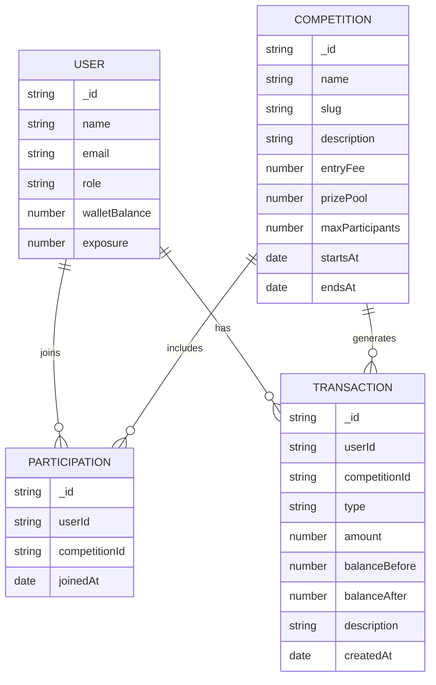
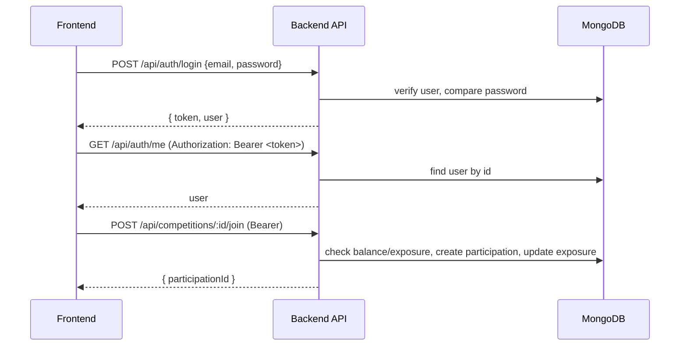

# Backend (Mini Competition Dashboard)

## Prerequisites

- Node.js 18+
- npm 9+
- MongoDB 6+ (local or connection string)

## Environment Variables

Create a `.env` in `backend/`:

```env
NODE_ENV=development
PORT=4000
API_URL=http://localhost:4000/api
MONGO_URI=mongodb://localhost:27017/innohive
JWT_SECRET=change_this_in_prod
JWT_EXPIRES_IN=7d
RATE_LIMIT_WINDOW_MS=60000
RATE_LIMIT_MAX=100
```

## Install & Run

```bash
cd backend
npm install
npm run dev     # runs with ts-node-dev (hot reload)
# or
npm run build && npm start
```

Server starts at `http://localhost:4000`. API base path: `/api`.

## API Documentation (Swagger)

- UI: `http://localhost:4000/api/docs`
- JSON: `http://localhost:4000/api/docs/json`

Auth uses Bearer JWT in `Authorization: Bearer <token>`.

### Main Endpoints

- Auth
  - POST `/api/auth/register`
  - POST `/api/auth/login`
  - GET `/api/auth/me` (auth)
  - POST `/api/auth/logout` (auth)

- Competitions
  - GET `/api/competitions` (query: `page`, `limit`, `joined`, `search`, `sort`)
  - GET `/api/competitions/:id` (auth optional; joined flag when auth)
  - POST `/api/competitions/:id/join` (auth)
  - GET `/api/competitions/:id/participants` (auth)
  - GET `/api/competitions/:id/chart` (auth)

- Admin (role: ADMIN)
  - POST `/api/admin/competitions`
  - PATCH `/api/admin/competitions/:id`
  - DELETE `/api/admin/competitions/:id`
  - POST `/api/admin/competitions/:id/declare`

## Data Model (simplified)



## Request Flow



## Local Development Tips

- Logs: `backend/combined.log`, `backend/error.log`
- Seed data: `backend/infra/seed/competitions.json` (use your preferred seeding approach)
- Tests: `npm test`

## Security Notes

- Use HTTPS and secure cookies in production.
- Rotate `JWT_SECRET` and set strong `JWT_EXPIRES_IN` per requirements.
- Rate limiting configured via `RATE_LIMIT_*` env vars.

## Versioning

- OpenAPI: 3.0
- API version: 1.0.0 (see Swagger `info.version`)


