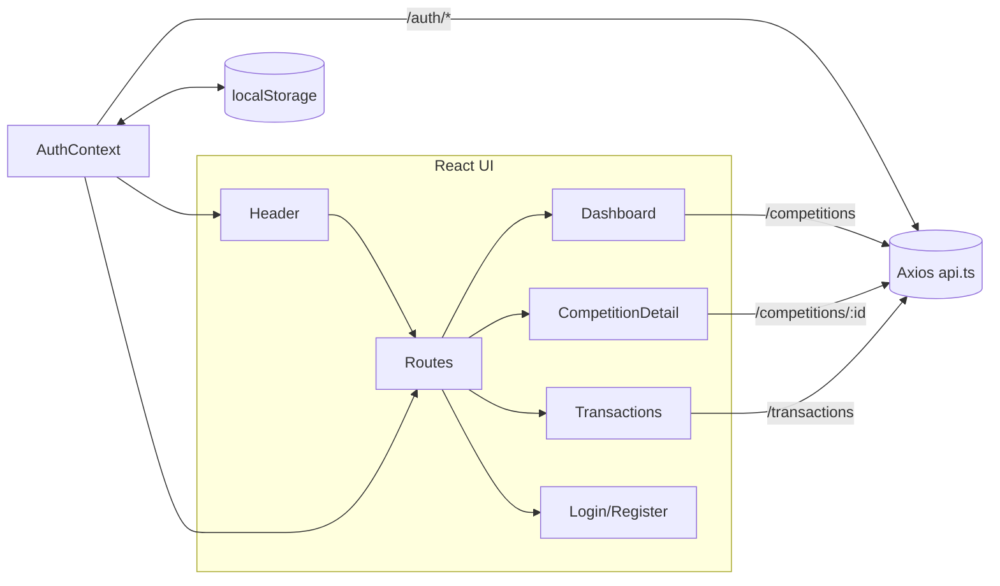
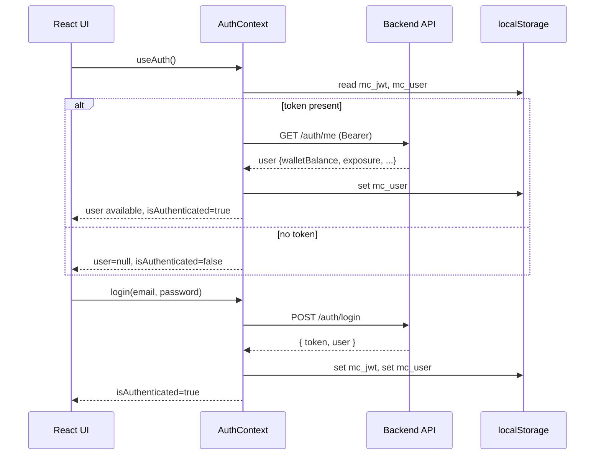
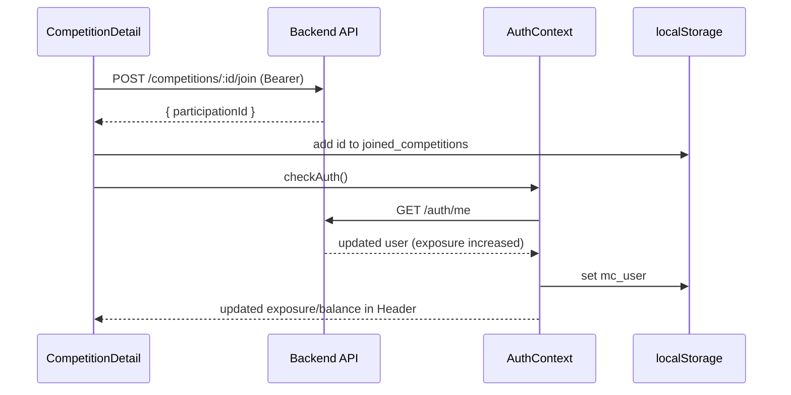

# Frontend (Mini Competition Dashboard)

## Tech Stack

- React + TypeScript
- Vite (dev/build)
- Tailwind CSS
- Axios

## Prerequisites

- Node.js 18+
- npm 9+

## Environment Variables

Create `.env` in `frontend/` (or use `.env.local`):

```env
VITE_API_URL=http://localhost:4000/api
```

If not set, the app defaults to `http://localhost:4000/api`.

## Install & Run

```bash
cd frontend
npm install
npm run dev         # starts Vite dev server
# Open the URL printed by Vite (usually http://localhost:5173)
```

## Build & Preview

```bash
npm run build       # outputs to dist/
npm run preview     # serves the production build locally
```

## Auth & Storage

- JWT token is stored in `localStorage` key `mc_jwt`
- User snapshot is stored in `localStorage` key `mc_user`
- Joined competitions cache stored in `localStorage` key `joined_competitions`

Auth context loads a cached user (if present) and calls `/auth/me` to refresh. The UI considers you authenticated if a token is present (so nav renders promptly) and replaces the cached user with the server response when ready.

## Project Structure (key files)

- `src/contexts/AuthContext.tsx`: global auth state, login/logout/checkAuth
- `src/api/api.ts`: Axios instance + interceptors
- `src/api/auth.ts`: login, register, getMe
- `src/api/competitions.ts`: competitions API
- `src/components/Header.tsx`: top navigation (exposure, balance, logout)
- `src/components/ProtectedRoute.tsx`: route guard
- `src/pages/*`: views (Dashboard, CompetitionDetail, Login/Register, Transactions)
- `src/constants/storage.ts`: `USER_STORAGE_KEY`, `TOKEN_STORAGE_KEY`
- `src/utils/joinedCompetitions.ts`: local cache helpers

## Routing

- `/` → redirects to `/dashboard`
- `/dashboard` → competitions list and charts
- `/competitions/:id` → competition details and join
- `/transactions` → user transactions
- `/login`, `/register` → auth pages

Protected routes use `ProtectedRoute` and `useAuth()`.

## UI Notes

- Tailwind config in `tailwind.config.js`
- Global styles in `src/index.css`

## Troubleshooting

- Header shows Login/Register despite token:
  - Ensure `VITE_API_URL` points to a reachable backend
  - Check browser console/network for `/auth/me` response
- Exposure shows 0:
  - Ensure `/auth/me` returns `exposure` and the frontend receives it (CORS/URL)
  - Try logging out and back in (refreshes snapshot)

## Mermaid Diagrams

### Frontend Architecture



### Auth Flow



### Join Competition Flow




